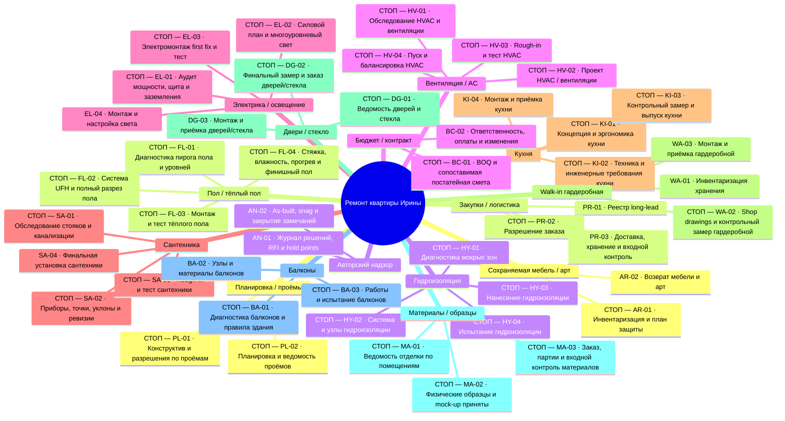
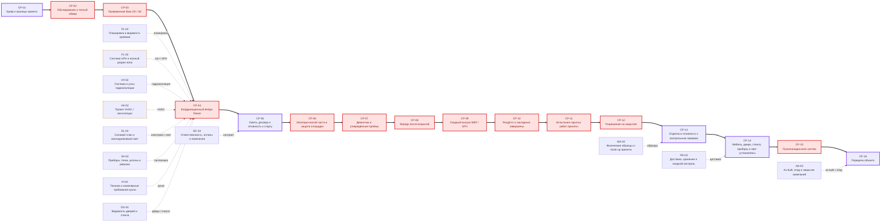

# Mermaid-карта WBS и зависимостей

Версия: 22.09.2026. Верхняя схема показывает иерархию всех потоков. Нижняя — обзор критического пути; он логический, а не календарный, пока нет подтверждённых длительностей и дат.

## 1. Иерархическая WBS / mind map

## 2. Критический путь и подключение потоков

Легенда: толстая стрелка = основной критический путь; красный узел со словом СТОП = решение нельзя подтверждать до проверки; пунктирная рамка = ответственный специалист ещё не назначен. Точная последовательность гидроизоляции, UFH и стяжки уточняется после выбора системного пирога.
